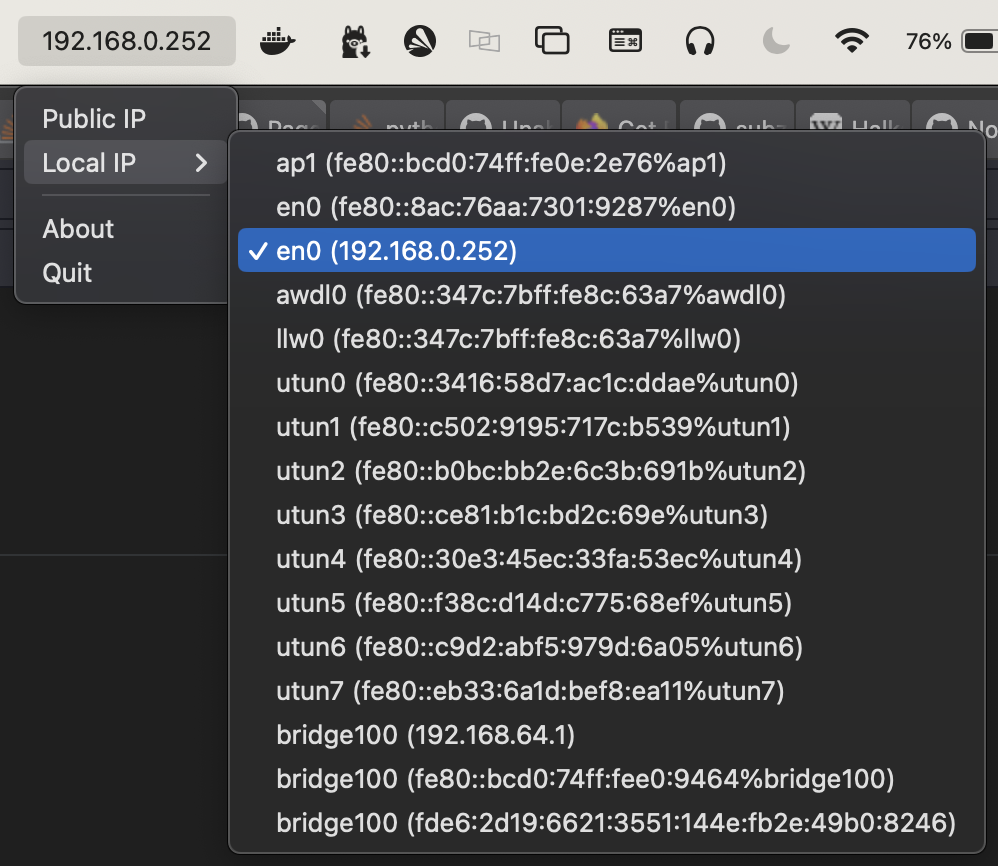

# IPMenuBar

> Needed something like this to make my life a little easier so instead of downloading already existing one I created yet another one...

`IPMenuBar` is a simple macOS menu bar application that displays the user's IP address. It provides two modes for retrieving the IP address: `Public IP` and `Local IP`.



## Install

### Using Homebrew

You can easily install `IPMenuBar` using Homebrew by running the following commands in your terminal:

```bash
brew tap janekbaraniewski/homebrew-janekbaraniewski
brew install --cask ipmenubar
```

#### Allowing the App to Run on macOS

Due to macOS security settings, you might need to manually allow your system to open IPMenuBar if it's downloaded from the internet.

After attempting to open IPMenuBar for the first time, follow these steps if you see a warning message stating that the app cannot be opened:

- Open System Preferences: Click on the Apple logo in the top-left corner of your screen, and select "System Preferences."

- Security & Privacy: Navigate to the "Security & Privacy" panel.

- General Tab: Stay on or switch to the "General" tab where you should see a message at the bottom about IPMenuBar being blocked.

- Allow Anyway: Next to the message about IPMenuBar being blocked, click "Allow Anyway." This button allows macOS to run apps from unidentified developers that you specifically approve.

- Confirm Your Choice: Try to open IPMenuBar again. This time, you'll see a dialog that asks if you're sure you want to open the app. Click "Open" to confirm.

By following these steps, you should be able to run IPMenuBar on your Mac. If you update IPMenuBar in the future, you might need to repeat these steps to allow the new version to run.

## Modes

### Public IP

In `Public IP` mode, `IPMenuBar` fetches the public IP address of the user's network connection using the [`ipify`](https://www.ipify.org) API.

### Local IP

In `Local IP` mode, `IPMenuBar` retrieves the local IP address of the user's device within the local network. It scans the network interfaces of the device and identifies the IP address assigned to the active network interface.
